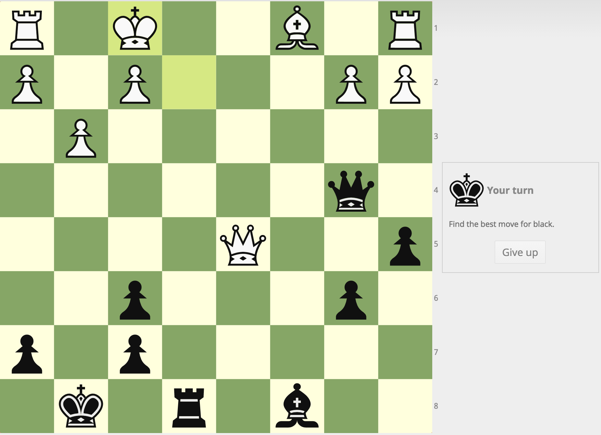
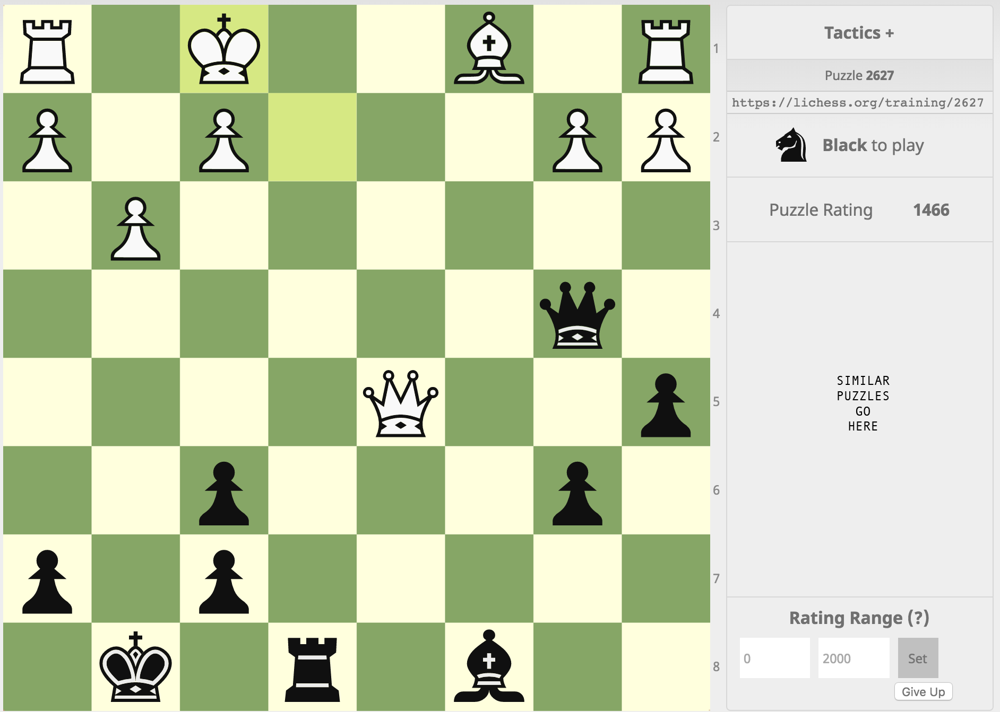

# Chess Analytics

## Part 1: Scraping problems and inserting to Mongo
In the repo you'll find three scripts
- getPuzzles.sh
- scrape.sh
- puzzlesToDb.js

`getPuzzles.sh` Runs the latter two together for convenience

`scrape.sh` Scrapes puzzles from lichess.com

`puzzlesToDb.js` Inserts all scraped puzzles to a Mongo database with URL `mongodb://localhost:27017/chess`

All scripts are thoroughly commented and should be very readable.

#### Running them yourself
Requirements
- bash
- node (v0.12 or Later, Current version is 6.3.1 fyi so you're probably good here)
- mongodb node module installed

```bash
# In the project directory...
npm install mongodb
```
- Don't forget to chmod the two shell scripts to be executable!

```bash
sudo chmod +x ./scrape.sh
sudo chmod +x ./getPuzzles.sh
```

Run It
```bash
# Assuming all requirements are met
./getPuzzles.sh
```

#### Example output
```bash
Getting puzzles
Scraping 5 problems...
1 / 5
2 / 5
3 / 5
4 / 5
5 / 5
Done
Connected correctly to server.
Inserted:  1
Inserted:  2
Inserted:  3
Inserted:  4
Inserted:  5
Done Inserting to database
```

## Part 2: Chrome Extension and Backend
Files for this step can be found in the api and ext directory

#### Backend
The backend is an [Eve](http://python-eve.org/) server. It allows the extension to connect to my scraped puzzle database.
There are two files in the api directory
- `settings.py` Eve server settings which contain the puzzle schema and which fields puzzles can be queried by
- `run.py` Short script to include and run the server (settings.py)

#### Extension
The extension adds more information about the current puzzle
##### Without extension

##### With Extension


## Part 3: Puzzle Similarity
Files for this can be found in the position_analysis directory